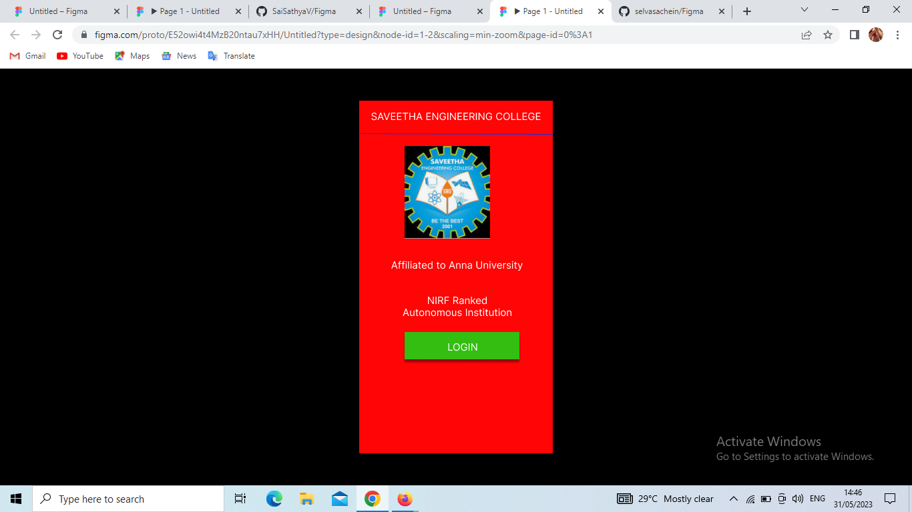

# Event Registration Web Application

## AIM:
To design, develop and deploy a web application for event registration.

## DESIGN STEPS:

### Step 1:
Create a new frame.

### Step 2:
Select any one preset size of your choice.

### Step 3:
Select the shapes you need.

### Step 4:
Import images as needed.

### Step 5:
Create pages based on your need and link them.

### Step 6:

Validate the HTML and CSS code.

### Step 6:

Publish the website in the given URL.

## DESIGN TOOL:
Figma

## code:
```
/* Malar page */


position: relative;
width: 290px;
height: 529px;

background: #FF0505;
box-shadow: 0px 4px 4px rgba(0, 0, 0, 0.25);
transform: matrix(1, 0, 0, -1, 0, 0);


/* Login Page */


position: relative;
width: 334px;
height: 535px;

background: #EDE418;
box-shadow: 0px 4px 4px rgba(0, 0, 0, 0.25);


/* Frame 2 */


position: relative;
width: 37px;
height: 2px;

background: #FFFFFF;
box-shadow: 0px 4px 4px rgba(0, 0, 0, 0.25);
/* SEC Page */
position: relative;
width: 313px;
height: 535px;
background: #D90EEB;
box-shadow: 0px 4px 4px rgba(0, 0, 0, 0.25);
```
## OUTPUT:



## RESULT:
The program to design, develop and deploy a web application for event registration is completed successfully.